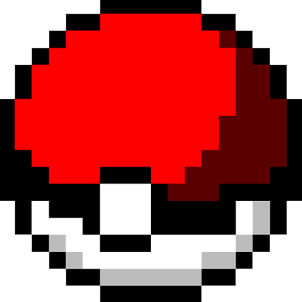

    
    

        <h1 style="color:#4d1d4d; text-shadow: -2px -1px 0 #000,  
                                           1px -1px 0 #000,  
                                          -1px 1px 0 #000,  
                                           1px 1px 0 #000;">P O K E M O N </h1>
        <h3 style="color: antiquewhite;margin-top: -25px; text-shadow: -1px -1px 0 #000,  
                                                  1px -1px 0 #000,  
                                                 -1px 1px 0 #000,  
                                                  1px 1px 0 #000;">Una Batalla Epica </h3>
    

# Índice

1. [Pokemon](#pokemon)
    - [Menu principal](#menu-principal)
    - [Comenzar partida](#comenzar-partida)
    - [Sobre nosotros](#sobre-nosotros)
    - [Salir](#salir)
2. [Catálogo](#catálogo)
    - [Tipo Normal](#tipo-normal)
    - [Tipo Fuego](#tipo-fuego)
    - [Tipo Agua](#tipo-agua)
    - [Tipo Planta](#tipo-planta)
    - [Tipo Eléctrico](#tipo-eléctrico)
    - [Tipo Hielo](#tipo-hielo)
    - [Tipo Lucha](#tipo-lucha)
    - [Tipo Veneno](#tipo-veneno)
    - [Tipo Tierra](#tipo-tierra)
    - [Tipo Volador](#tipo-volador)
    - [Tipo Psíquico](#tipo-psíquico)
    - [Tipo Bicho](#tipo-bicho)
    - [Tipo Roca](#tipo-roca)
    - [Tipo Fantasma](#tipo-fantasma)
    - [Tipo Dragón](#tipo-dragón)
    - [Tipo Siniestro](#tipo-siniestro)
    - [Tipo Acero](#tipo-acero)
    - [Tipo Hada](#tipo-hada)

El proyecto sera un juego de pelea pokemon que dara la posibilidad a los jugadores de pelearse contra un bot o contra un segundo jugador. 

## Menu principal
Lo primero que mostrara sera un menu con este estilo:

´´´ Consola
>1) Comenzar Partida
>2) Sobre nosotros
>3) Salir
´´´
### Comenzar partida
comenzara una nueva partida donde se mostrara un menu para seleccionar los pokemones.
tendra un formato en donde primero se selecciona un tipo de pokemon y luego el pokemon.
Para una primera version se penso en **4 pokemones de cada tipo**, siendo 18 tipos daria un total de 72 pokemones.
se seleccionaran 6 pokemones por cada jugador.

### Sobre nosotros
abrira un JFrame en donde se mostrara info sobre mi, como surgio la idea y un link a mi git

### Salir
simplemente dara por terminada

## catalogo
el catalago ofrecera 72 pokemones, tendra ciertas cosas restringidas como los accesorios de pokemones, es decir, solo se podra pelear con los movimientos posibles de defensa, ataque u otros movimientos

### Tipo Normal
    1. Rattata
    2. Eevee
    3. Meowth
    4. Lillipup

### Tipo Fuego
    5. Charmander
    6. Vulpix
    7. Growlithe
    8. Litwick

### Tipo Agua
    9. Squirtle
    10. Psyduck
    11. Wooper
    12. Froakie

### Tipo Planta
    13. Bulbasaur
    14. Oddish
    15. Treecko
    16. Bounsweet

### Tipo Eléctrico
    17. Pikachu
    18. Electrike
    19. Shinx
    20. Yamper

### Tipo Hielo
    21. Snorunt
    22. Vanillite
    23. Cubchoo
    24. Bergmite

### Tipo Lucha
    25. Machop
    26. Hitmonlee
    27. Riolu
    28. Scraggy

### Tipo Veneno
    29. Ekans
    30. Gastly
    31. Croagunk
    32. Salandit

### Tipo Tierra
    33. Sandshrew
    34. Diglett
    35. Phanpy
    36. Drilbur

### Tipo Volador:
    37. Pidgey
    38. Zubat
    39. Wingull
    40. Rookidee
    
### Tipo Psíquico:
    41. Abra
    42. Espeon
    43. Ralts
    44. Gothita

### Tipo Bicho:
    45. Caterpie
    46. Venonat
    47. Wurmple
    48. Sewaddle

### Tipo Roca:
    49. Geodude
    50. Onix
    51. Roggenrola
    52. Rockruff

### Tipo Fantasma:
    53. Gastly
    54. Shuppet
    55. Yamask
    56. Phantump

### Tipo Dragón:
    57. Dratini
    58. Bagon
    59. Gible
    60. Deino

### Tipo Siniestro:
    61. Murkrow
    62. Sneasel
    63. Purrloin
    64. Inkay

### Tipo Acero:
    65. Magnemite
    66. Aron
    67. Honedge
    68. Togedemaru

### Tipo Hada:
    69. Cleffa
    70. Snubbull
    71. Swirlix
    72. Spritzee

